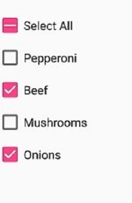
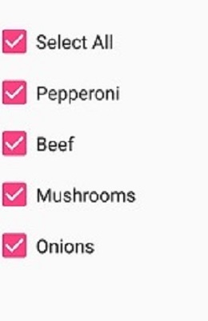

# Getting Started for Xamarin.Forms SfCheckBox
This is demo application of Xamarin.Forms SfCheckBox control. The minimal set of required properties have been configured in this project to get started with SfCheckBox in Xamarin.Forms.

For more details please refer the Xamarin.Forms SfCheckBox UG documentation [Getting Started](https://help.syncfusion.com/xamarin/checkbox/getting-started) link.

## <a name="requirements-to-run-the-demo"></a>Requirements to run the demo ##

* [Visual Studio 2019 or Visual Studio 2017](https://visualstudio.microsoft.com/downloads/) or [Visual Studio for Mac](https://visualstudio.microsoft.com/vs/mac/).
* Xamarin add-ons for Visual Studio (available via the Visual Studio installer).

## <a name="troubleshooting"></a>Troubleshooting ##
### Path too long exception
If you are facing path too long exception when building this example project, close Visual Studio and rename the repository to short and build the project.

## <a name="description"></a>Description ##

### Initialize SfCheckBox

Import the [`SfCheckBox`](https://help.syncfusion.com/cr/xamarin/Syncfusion.XForms.Buttons.SfCheckBox.html) namespace as shown below in your respective Page,

###### Xaml
```xaml
xmlns:syncfusion="clr-namespace:Syncfusion.XForms.Buttons;assembly=Syncfusion.Buttons.XForms"
```
###### C#
```C#
using Syncfusion.XForms.Buttons;
```
The [`SfCheckBox`](https://help.syncfusion.com/cr/xamarin/Syncfusion.XForms.Buttons.SfCheckBox.html) allows an indeterminate state in addition to the checked and unchecked state. The indeterminate state of the check box is enabled by setting the [`IsThreeState`](https://help.syncfusion.com/cr/xamarin/Syncfusion.XForms.Buttons.ToggleButton.html#Syncfusion_XForms_Buttons_ToggleButton_IsThreeState) property of the control to `True`.

> **_NOTE:_**  When the [`IsThreeState`](https://help.syncfusion.com/cr/xamarin/Syncfusion.XForms.Buttons.ToggleButton.html#Syncfusion_XForms_Buttons_ToggleButton_IsThreeState) property is set to `False` and [`IsChecked`](https://help.syncfusion.com/cr/xamarin/Syncfusion.XForms.Buttons.ToggleButton.html#Syncfusion_XForms_Buttons_ToggleButton_IsChecked) property is set to `null` then the check box will be in unchecked state.

The indeterminate state is used when a group of sub-choices has both checked and unchecked states. In the following example, the "Select all" checkbox has the [`IsThreeState`](https://help.syncfusion.com/cr/xamarin/Syncfusion.XForms.Buttons.ToggleButton.html#Syncfusion_XForms_Buttons_ToggleButton_IsThreeState) property set to `true`. The "Select all" checkbox is checked if all child elements are checked, unchecked if all the child elements are unchecked, and indeterminate otherwise.

###### Xaml
```xaml
<syncfusion:SfCheckBox x:Name="selectAll" Text="Select All" IsChecked="{x:Null}" StateChanged="SelectAll_StateChanged"/>
<syncfusion:SfCheckBox x:Name="pepperoni" Text="Pepperoni" StateChanged="CheckBox_StateChanged"/>
<syncfusion:SfCheckBox x:Name="beef" Text="Beef" IsChecked="True" StateChanged="CheckBox_StateChanged"/>
<syncfusion:SfCheckBox x:Name="mushroom" Text="Mushrooms" StateChanged="CheckBox_StateChanged"/>
<syncfusion:SfCheckBox x:Name="onion" Text="Onions" IsChecked="True" StateChanged="CheckBox_StateChanged"/>
```
###### C#
```C#
bool skip = false;
SfCheckBox selectAll, pepperoni, beef, mushroom, onion;
selectAll = new SfCheckBox();
selectAll.StateChanged += SelectAll_StateChanged;
selectAll.Text = "Select All";
pepperoni = new SfCheckBox();
pepperoni.StateChanged += CheckBox_StateChanged;
pepperoni.Text = "Pepperoni";
beef = new SfCheckBox();
beef.StateChanged += CheckBox_StateChanged;
beef.Text = "Beef";
beef.IsChecked = true;
mushroom = new SfCheckBox();
mushroom.StateChanged += CheckBox_StateChanged;
mushroom.Text = "Mushrooms";
onion = new SfCheckBox();
onion.StateChanged += CheckBox_StateChanged;
onion.Text = "Onions";
onion.IsChecked = true;

private void SelectAll_StateChanged(object sender, StateChangedEventArgs e)
{
    if (!skip)
    {
       skip = true;
       pepperoni.IsChecked = beef.IsChecked = mushroom.IsChecked = onion.IsChecked = e.IsChecked;
       skip = false;
    }
}

private void CheckBox_StateChanged(object sender, StateChangedEventArgs e)
{
    if (!skip)
    {
       skip = true;
       if (pepperoni.IsChecked.Value && beef.IsChecked.Value && mushroom.IsChecked.Value && onion.IsChecked.Value)
           selectAll.IsChecked = true;
       else if (!pepperoni.IsChecked.Value && !beef.IsChecked.Value && !mushroom.IsChecked.Value && !onion.IsChecked.Value)
	       selectAll.IsChecked = false;
       else
           selectAll.IsChecked = null;
       skip = false;
    }
}

```

## <a name="output"></a>Output ##

 
